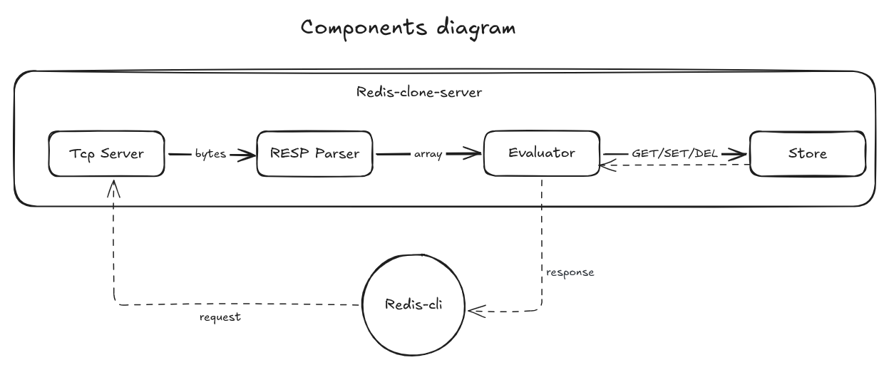

As part of the **Get to know Redis** series, we'll explore how **Redis** communicates with clients using the **RESP** protocol, and build our own Redis-compatible server from scratch.

By the end of this article you'll:

- Understand why Redis uses RESP.
- Build a TCP server in Go.
- Parse RESP requests.
- Execute basic Redis commands.
- Connect a real redis-cli client to your server.
- Benchmark your implementation against Redis.

## Building a Tcp server

When you install redis it comes with a server and a client, the client lets you writes commands and the server responds to it, very simple isn't ?

But like any other 2 entities in the world we need some sort of **protocol** that defines the communication rules between these 2, the best option for that is **Tcp**; a reliable byte-stream protocol that let us transmit any kind of data as bytes without losing data (unlike Udp), this protocol is widely used in chat systems, transactions and so on.

Let's now implement our own Tcp server that lets clients sends messages to it and it can respond back.

Here is a simple TCP echo server written in go where a client connects to port 3000 using telnet, send messages to the server and the server echoes the received message back.

```go
package main

import (
	"io"
	"log"
	"net"
)

func handleConnection(conn net.Conn) {
	defer conn.Close()

    // Buffer of 1KB for holding incoming data
	buffer := make([]byte, 1024) 

	for {
		n, err := conn.Read(buffer)
		if err != nil {
			if err != io.EOF {
				log.Println("read error:", err)
			}
			return
		}

		// Echo the received bytes back to the client.
		_, err = conn.Write(buffer[:n])
		if err != nil {
			log.Println("write error:", err)
			return
		}
	}
}

func main() {
	listener, err := net.Listen("tcp", ":3000")
	if err != nil {
		log.Fatal(err)
	}
	defer listener.Close()

	log.Println("Server listening on :3000")

	// Accept many clients
	for {
		conn, err := listener.Accept()
		if err != nil {
			log.Println("accept error:", err)
			continue
		}
		
		// Each client gets its own handleConnection running
        // in the background without blocking the server. 
		go handleConnection(conn)
	}
}
```

Run the server
```zsh 
go run server.go
```

Open many terminals and run as many clients as you wish, write a message, and watch it get echoed.
```zsh
nc localhost 3000
```

You should feel great about building your first Go TCP server. I remember how exciting it was when I made mine!

## Limitations - Why our TCP server isn't enough

In the implementation we made buffer of size 1 KB for intercepting incoming data from client, we continue reading incoming data from that buffer, but what if the client sends this request to get name `GET name` then to set age `SET age 20`, naively you would expect that  the 2 commands will be intercepted from the server as they were sent, but unfortunately this is not how Tcp work. Tcp's main role is to send continuous stream of bytes, in other words it gives you whatever bytes have arrived so far, so it can simply give you `GET na`  `meSE`  `T age 20` separated and the buffer will hold each of them on every read, or it might give you `GET nameSET age 20` as one shot, so as result we will not know where the commands start and where they end, this is called <span class="tooltip" data-tooltip="The process of determining where one message starts and where the next one ends when reading a stream of bytes.">**message framing**</span>.

## Solutions

To fix that we may consider 3 solutions:

- Fixed size commands - all commands and args have fixed size: This lead to memory waste.
- Read until delimiter - The commands start/end is known by a specific delimiter (\n for example): But what if the data itself contains this delimiter as part of it (remember we are not sending just text, we can send images, pdf, json, or any kind of binary data)
- Redis adopted solution - RESP

## RESP

After seeing the limits of our TCP server we need now something that can solve those limitations and at the same time it should :

- Handle binary data, aka <span class="tooltip" data-tooltip="Can handle arbitrary binary data including non ASCII characters like images and media files.">binary-safe.</span>
- Compatible with byte-stream protocol like Tcp.
- It will be nice if it's simple to implement.

And here it comes our RESP protocol which runs perfectly with byte-stream protocols like TCP, its binary-safe, and thanks to God its human-readable.

To solve the problems we encountered in our Tcp server, redis has first defined what a server should expect as request from the client, and what a client should expect as response from the server, fair enough.

- A client can send an array of bulk strings, for example if you type `GET name` the server should receive \["GET", "name"\]

- A server respond with either an array, simple string, bulk string, integer, error even a null bulk string (RESP3 has more fancy datatypes)

After defining a civilized way of communication between two entities we need now to solve the main problem, how to make the protocol binary-safe .

Take a time and try to make some assumptions, write it down, this is how real engineers do things, they start from a problem, try a solution, upgrade it until it come to you as a final ready-to-use product.
The mental model used is simple, **instead of guessing, give the length of each command**.
Here is the simple analogy RESP uses:

Because the server excepts commands to be an array of strings it should know 2 things:

- The length of the array: <span>`*<number>`</span>.

- For each element of the array prefix it with its length in bytes (how many bytes should i read ?): <span>`$<number>`</span>.

example:

```c
*3\r\n // Im sending an array of 3 elements
$3\r\n // The first element has 3 bytes 
SET\r\n // The first element as raw string
$4\r\n // The second element has 4 bytes ('n' 'a' 'm' 'e')
name\r\n // Notice the delimiters (\r\n) after every sequence
$1\r\n
5\r\n
```

But wait, what is this weird \r\n everywhere ?!
This is CRLF, a delimiter used to know the length of the lengths, weird, right ? Simply this is what indicates the end of the headers used in commands, and the choice of using it in all elements is a design choice.

## Build a RESP parser

Until this point you should be able to understand how resp works, what problems it solves and what are its advantages.
Now lets move to the interesting part, the active learning, let's build our own resp parser, connect it with a real redis client  and perform basics commands like get, set, del.



The architecture is simple, each component is responsible for one thing, we will cover each of them in the next sections, but know let's start implementing the parser.
The parser written here is not a production parser, it's just a toy parser for this tutorial use. 

```go
// The goal is to turn commands 
// like `SET name Taha` to `[]string{"SET", "name", "Taha"}`
func Parse(r *bufio.Reader) ([]string, error) {
	// Hold command and its arguments
	var array []string

	var array_length_str strings.Builder
	// Read first line
	line, err := r.ReadBytes('\r')
	if err != nil {
		return array, err
	}
	if line[0] == '*' {
		for _, b := range line[1 : len(line)-1] { //skip line[0] and \r
			if b >= '0' && b <= '9' {
				array_length_str.WriteByte(b)
			} else {
				return array, errors.New("Number expected")
			}
		}
		// skip \n
		if _, err := r.ReadByte(); err != nil {
			return array, err
		}
	}

	// Loop array_length time
	iterations, err := strconv.Atoi(array_length_str.String())
	if err != nil {
		return array, err
	}
	var arg_length_str strings.Builder
	for range iterations {
		arg_length_str.Reset()
		// Read line containing the command length
		line, err := r.ReadBytes('\r')
		if err != nil {
			return array, err
		}
		if line[0] == '$' {
			for _, b := range line[1 : len(line)-1] { //remove line[0] and \r
				if b >= '0' && b <= '9' {
					arg_length_str.WriteByte(b)
				} else {
					return array, errors.New("Number expected")
				}
			}
			// skip \n
			if _, err := r.ReadByte(); err != nil {
				return array, err
			}
		}
		// Read line containing the cmd
		num, err := strconv.Atoi(arg_length_str.String())
		if err != nil {
			return array, err
		}
		cmd := make([]byte, num)
		if _, err = io.ReadFull(r, cmd); err != nil {
			return array, err
		}
		array = append(array, string(cmd))
		// skip \r\n
		if _, err = r.Discard(2); err != nil {
			return array, err
		}
	}
	return array, nil
}

```

I know the error handling in go is kind of frustrating, but believe it or not, I like it more than `Exceptions` in other languages.

## Putting the Pieces Together: Build your own redis

After making the parser we should now evaluate and execute what we've parsed, let's add an evaluation function, be patient we are close.

```go
func Evaluate(s *Store, req []string) (string, error) {
	if len(req) == 0 {
		return "", errors.New("Empty array to evaluate")
	}

	switch strings.ToLower(req[0]) {
	case "ping":
		switch len(req) {
		case 1:
			return "+PONG\r\n", nil
		case 2:
			return fmt.Sprintf("$%d\r\n%s\r\n", len(req[1]), req[1]), nil
		default:
			return "-ERR wrong number of arguments for 'ping' command\r\n", nil
		}

	case "echo":
		if len(req) != 2 {
			return "-ERR wrong number of arguments for 'echo' command\r\n", nil
		}
		return fmt.Sprintf("$%d\r\n%s\r\n", len(req[1]), req[1]), nil

	case "set":
		if len(req) < 3 {
			return "-ERR wrong number of arguments for 'set' command\r\n", nil
		}
		s.Set(req[1], req[2])
		return "+OK\r\n", nil

	case "get":
		if len(req) != 2 {
			return "-ERR wrong number of arguments for 'get' command\r\n", nil
		}
		elm, ok := s.Get(req[1])
		if !ok {
			return "$-1\r\n", nil //nil is -1
		} else {
			return fmt.Sprintf("$%d\r\n%s\r\n", len(elm), elm), nil
		}

	case "del":
		if len(req) < 2 {
			return "-ERR wrong number of arguments for 'del' command\r\n", nil
		}
		j := 0
		for _, elm := range req[1:] {
			j += s.Del(elm)
		}
		return fmt.Sprintf(":%d\r\n", j), nil

	case "exists":
		if len(req) < 2 {
			return "-ERR wrong number of arguments for 'exists' command\r\n", nil
		}
		j := 0
		for _, elm := range req[1:] {
			j += s.Exists(elm)
		}
		return fmt.Sprintf(":%d\r\n", j), nil
		
	default:
		return fmt.Sprintf("-ERR unknown command '%s'\r\n", req[0]), nil
	}
}
```
The weird return strings are part of the <span class="tooltip" data-tooltip="The major ones are: simple strings prefixed by '+' for static replies (ok, pong...), while  bulk strings prefixed by '$<length>' are for dynamic replies and can contain any type of data, there are also arrays(*), integers(:) and errors(-) ">**redis datatypes**</span>, where each type is prefixed with a symbol.

As you may have noticed we moved the operations related to data management to an external entity called `Store` this way each part can scale individually, and to be honest i'm planning to add sharding later on because i'm not happy with having one giant shared  hashmap for storage.

The store handles the operations used in the hashmap such as get, set and del and handles also the concurrency with mutex (yup, the store can be accessed by many clients at the same time so we have to set a security guard in front of our store to prevent race condition).

Here is our Store:

```go
type Store struct {
	table map[string]string // The hashmap used to store our data
	mu    sync.RWMutex // Fancy mutex
}

func NewStore() *Store {
	return &Store{
		table: make(map[string]string),
	}
}

func (s *Store) Set(key, val string) {
	s.mu.Lock() // Lock readers & writers
	s.table[key] = val
	s.mu.Unlock()
}

func (s *Store) Get(key string) (string, bool) {
	s.mu.RLock() // Lock just the writers, readers can access at the same time
	val, ok := s.table[key]
	s.mu.RUnlock()
	return val, ok
}

func (s *Store) Del(key string) int {
	s.mu.Lock() // Lock readers & writers
	defer s.mu.Unlock() // Unlock the mutex after exiting the func

	if _, ok := s.table[key]; ok {
		delete(s.table, key)
		return 1
	}

	return 0
}

func (s *Store) Exists(key string) int {
	s.mu.RLock()
	defer s.mu.RUnlock() // Unlock the mutex after exiting the func

	if _, ok := s.table[key]; ok {
		return 1
	}

	return 0
}

```

We now have every piece we need: a TCP server, a RESP parser, a command evaluator, and a thread-safe store. All that's left is wiring them together.

Now change the handleConnection method and add parsing and evaluation, add also the run method

```go
func handleConnection(conn net.Conn, s *Store) {
	defer conn.Close()
	reader := bufio.NewReader(conn)
	for {
		parsed, err := Parse(reader)
		if err != nil {
			if err != io.EOF {
				fmt.Println(err)
			}
			return
		}
		msg, err := Evaluate(s, parsed)
		if err != nil {
			fmt.Println("Error in evaluate:", err)
			return
		}
		conn.Write([]byte(msg))
	}
}

func Run(addr string, s *Store) error {
	l, err := net.Listen("tcp", addr)
	if err != nil {
		return err
	}
	for {
		conn, err := l.Accept()
		if err != nil {
			return err
		}
		go handleConnection(conn, s)
	}
}
```

Update main

```go
package main

import (
	"fmt"
	"os"
	"sync"
)

func main() {
	s := NewStore()
	fmt.Println("Server Started")
	if err := Run("0.0.0.0:6380", s); err != nil {
		fmt.Println("Failed to start server:", err)
		os.Exit(1)
	}
}
```

Now to run and test what you've done so far :

Run the go server
`go run -race main.go `

Connect redis client with your server
`redis-cli -h 127.0.0.1 -p 6380`

Once you are in the interactive mode try these commands:

```bash
PING
ECHO Hy
SET name Taha
SET age 20
GET name
Exists name age sexe
```

Because we are accepting multiple connection it's crucial to handle race condition to protect our hashmap, and for that we've added a mutex and protected each write and read, the `-race` in the run command will help us detect any possible race conditions.

## Summary

We started with a simple TCP server, discovered why TCP alone isn't enough to exchange commands, learned how RESP solves the message framing problem, built a parser, implemented a command evaluator, and finally connected the official redis-cli to our own Redis-compatible server.

You also gained knowledge in interesting topics like networking, protocols, concurrency, and parsing. Give yourself a pat on the back and try to go beyond that—add persistence, expiration, and concurrency that actually scales. You can even benchmark it against the real Redis server and see how it performs!

I encourage you to visit [CodeCrafters](https://app.codecrafters.io)—it's a great resource for this.

You can check [Readthedocs](https://redis-doc-test.readthedocs.io/en/latest/topics/protocol/) for more about the RESP protocol.
