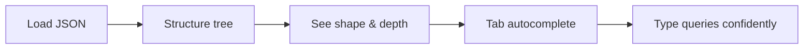
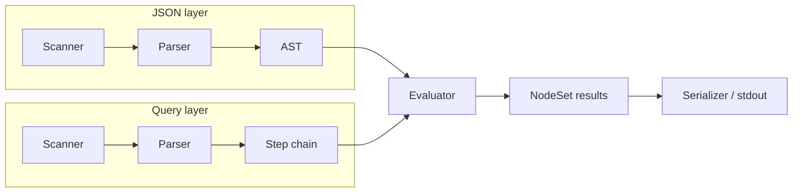
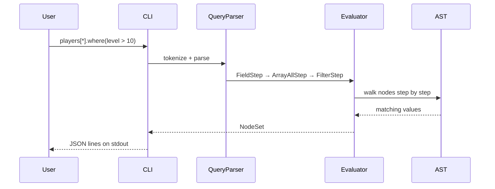

## Project brief

**J-QL** is a command-line tool for working with JSON in two modes: **explore** a document you do not understand yet, or **query** it from a script. Load a file into an interactive REPL with autocomplete and a structure tree, or pipe JSON from another command and pull out fields with a readable path-based query language.

The core idea: most JSON tools are great at *transforming* data you already understand. J-QL is built for the moment before that — when you receive a large API response or config file and need to **see the shape first**, then **ask questions** in plain, chainable syntax.

**Four pillars:**

| Pillar | What it means |
|--------|----------------|
| **Explore JSON** | REPL, structure tree, Tab autocomplete on real keys and indices |
| **Query language** | J-QL — paths, filters, projections, recursive search, dot-style builtins |
| **Parser / evaluator** | Separate front-ends for JSON and queries; queries compile to a step chain over an AST |
| **Pipe** | Read stdin, run `-q`, emit JSON — fits into `curl \| …` shell workflows |

---

## The problem

You get a JSON blob. Maybe from an API, a CI artifact, or a teammate’s export. You do not know where the fields live, how deep the nesting goes, or what to query. You need to **orient yourself**, then **extract** — without switching between three different tools.

J-QL does both in one binary.

---

## Explore JSON

### Interactive REPL

Open a file and work at a `json>` prompt. Type queries, use **Tab** for suggestions pulled from the loaded document (field names, array indices, string keys), and use **Up/Down** for history.

```bash
./json_parser data.json
```

```
json> structure 2
json> players[0].player
json> players[*].inventory[0].item
```

### Structure tree

A folder-style view of the document — objects, arrays, types, and counts — with optional depth limits for large files.

```bash
./json_parser data.json -tree 3
```

In the REPL: `structure` or `tree`, optionally `structure 3`.



---

## J-QL — the query language

J-QL (Json-Query Language) is inspired by `jq` but favors **readable dot syntax** over pipes. Queries are a **chain of steps** applied left to right.

### Path navigation

```text
players[0].player              →  "Steve"
players[*].player              →  all player names
players[0].inventory[0].item     →  "Diamond Sword"
```

### Builtins (dot style)

```text
players.length                 →  3
name.type                      →  "string"
meta.keys                      →  ["version", "active"]
```

### Filter, project, search

```text
players[*].where(level > 10)           →  high-level players only
players[0].{player, level}             →  { "player": "...", "level": ... }
..player                               →  every "player" field, anywhere
```

### One-shot & pipes

```bash
./json_parser data.json -q 'players.length'
curl -s https://api.example.com/users | ./json_parser -q 'items[0].name'
cat response.json | ./json_parser -q 'players[*].where(level > 10).{player, level}'
```

Pretty-print without a query (like `jq .`):

```bash
cat messy.json | ./json_parser
```

```mermaid
flowchart TB
    subgraph input [Input]
        F[File]
        P[Stdin pipe]
    end

    subgraph modes [Modes]
        R[REPL — explore]
        Q[-q — query]
        T[-tree — structure]
    end

    subgraph jql [J-QL]
        S1[Path steps]
        S2[.where filter]
        S3[.{ projection }]
        S4[.. recursive]
    end

    F --> R
    F --> Q
    F --> T
    P --> Q
    P --> T
    Q --> S1 --> S2 --> S3 --> S4
    S4 --> OUT[JSON on stdout]
```

---

## Parser & evaluator

The tool is built as a classic **language pipeline**, twice: once for JSON, once for J-QL.



**JSON path:** scan tokens → parse into an AST (objects, arrays, values) → hold in memory for queries and autocomplete.

**Query path:** scan J-QL tokens → parse into a **chain of steps** (`FieldStep`, `ArrayAllStep`, `FilterStep`, `ProjectionStep`, `BuiltinStep`, …) → evaluator walks the AST by applying each step to a set of nodes.

**Query context:** builtins and projections create temporary result nodes; a dedicated context owns that memory so results stay valid through evaluation and printing.

This split — **parse JSON once, parse query many times** — is what powers both the REPL (repeated queries on the same file) and `-q` (one query, exit).



---

## Architecture (modules)

| Module | Role |
|--------|------|
| `json/` | JSON scanner, parser, AST, reader (file / stdin), serializer |
| `Query/` | J-QL scanner, parser, step definitions, evaluator, query context |
| `cmd/` | Autocomplete engine, structure tree renderer |
| `Main` | REPL loop, meta-commands, one-shot `-q` / `-tree` |

---

## Why it is useful

- **API debugging** — pipe a response, run `structure 2`, then drill into fields
- **Config inspection** — explore nested `package.json`, k8s manifests, CI configs without opening a GUI
- **Shell scripts** — extract a value with `-q` and chain with other commands
- **Learning** — query syntax you can read without a cheat sheet: `players.length` instead of `players \| length`

J-QL is not trying to replace every JSON tool. It is optimized for **exploration first, extraction second** — the workflow you actually use when the JSON is new.

---

## Example session

**Input file** (`data.json` — game-style player records):

```json
{
  "players": [
    { "player": "Steve", "level": 12 },
    { "player": "Alex",  "level": 8  },
    { "player": "Maya",  "level": 20 }
  ]
}
```

```bash
# Explore
./json_parser data.json
# json> structure 2
# json> players.length          → 3
# json> players[*].where(level > 10).{player, level}

# Pipe
echo '{"players":[{"player":"Steve","level":12}]}' | ./json_parser -q 'players[0].player'
# → "Steve"
```

---

## Links

- **Repository:** [github.com/hammtah/J-QL](https://github.com/hammtah/J-QL)
